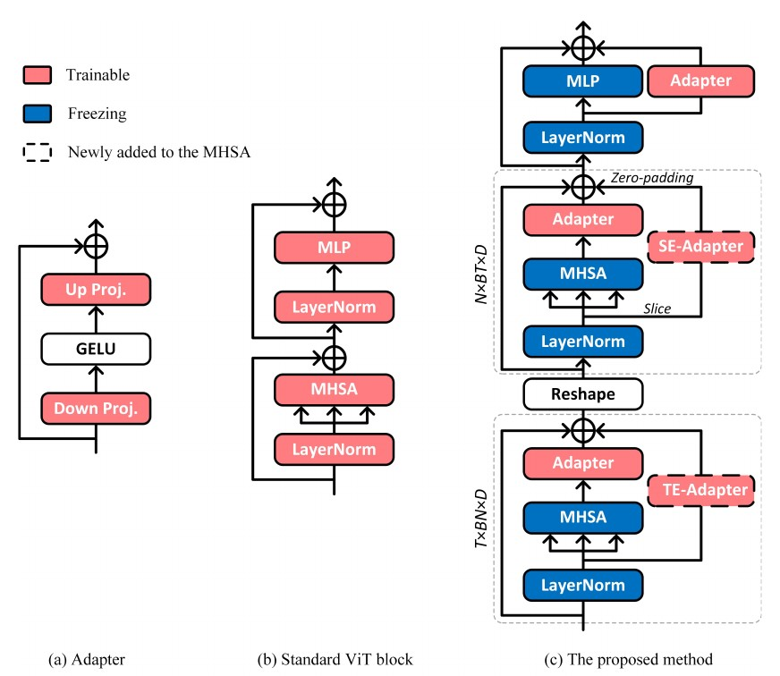

# Efficient learning of affective representations in user-generated videos via spatiotemporal emotional adaptation network

This repo is the official implementation of "Efficient learning of affective representations in user-generated videos via spatiotemporal emotional adaptation network".

## Introduction

In this work, we propose a novel Spatiotemporal Emotion Adaptation Network for recognizing emotions in a parameter efficient manner. The framework of the proposed method is shown as below.

<p></p>


## Installation

The codes are based on [AIM](https://github.com/taoyang1122/adapt-image-models), which is based on [MMAction2](https://github.com/open-mmlab/mmaction2). Thanks for their awesome works! To prepare the environment, please follow the following instructions.
```shell
# create virtual environment
conda create -n STEANet python=3.7.13
conda activate STEANet

# install pytorch
conda install pytorch==1.10.0 torchvision==0.11.0 torchaudio==0.10.0 cudatoolkit=11.3 -c pytorch -c conda-forge

# install other requirements
pip install -r requirements.txt

# install mmaction2
python setup.py develop
```

## Key Files
The proposed STEANet is implemented in [vit_clip.py](https://github.com/jinchow-zf/STEANet/blob/main/mmaction/models/backbones/vit_clip.py). You may refer to it for more details.


## Training
We use the CLIP checkpoints from the [official release](https://github.com/openai/CLIP). In our experiments, we choose ViT-B/16 as the image backbone by default, as it achieves a balance between
performance and computational complexity.

The training configurations for different experiments on the two datasets are provided in `configs/recognition/vit/`. To run the experiments, please use the following command. Replace `PATH/TO/CONFIG` with the path to the training configuration you want to use, and `PATH/TO/OUTPUT` with the directory where you want to save the output.
```shell
bash tools/dist_train.sh <PATH/TO/CONFIG> <NUM_GPU> --test-last --validate --cfg-options work_dir=<PATH/TO/OUTPUT>
```

## Evaluation
The code will do the evaluation after training. If you would like to evaluate a model only, please use the following command.
```shell
bash tools/dist_test.sh <PATH/TO/CONFIG> <CHECKPOINT_FILE> <NUM_GPU> --eval top_k_accuracy
```

Cheerfully, our work is under review. If you are interested in our work, please email to [jinchow21@sina.com](jinchow21@sina.com).


